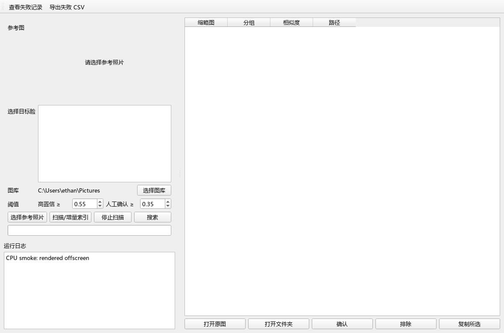

# 本地人脸照片检索 / Local Face Photo Search

> 100% 本地运行 · 不上传原图 · 人脸余弦相似度检索 · PySide6 桌面程序
>
> A fully-local face photo search desktop app. Your photos never leave your machine.

[](LICENSE)
[](pyproject.toml)
[](#)
[](.github/workflows/ci.yml)
[](#verification)

## 这是什么 / What is this

给你一张**参考照片**（可以含多张脸），选中目标脸，本程序会扫描你本机的照片
图库，按每张照片的**最高人脸余弦相似度**排序，返回可能含此人的整张照片。
**源照片只读，程序不上传、不修改、不删除任何原图。**

Pick a **reference photo** (with one or more faces), select the target face, and the
app scans your local photo library. Photos are ranked by the **maximum face cosine
similarity** against your target embedding. **Source photos are read-only — nothing
is uploaded, modified, or deleted.**



## 特性 / Features

- 🖥️ **PySide6 GUI**：参考图选择、多脸裁剪挑选、后台扫描、可取消、结果分高置信/人工确认两档
- ⚡ **GPU 加速**：自动检测 `CUDAExecutionProvider`；CUDA 初始化失败**静默回退** CPU
- 📂 **增量索引**：按 `(path, size, mtime_ns)` 跳过未变照片；崩溃恢复友好
- 🛡️ **损坏隔离**：单张损坏照片不会终止扫描，错误写入 `scan_failures`
- 🈶 **中文路径**：用 `Pillow` + `np.fromfile + cv2.imdecode` 绕过 `cv2.imread` 的 Unicode bug
- 💾 **SQLite WAL**：UI 与后台读写不互锁；10 万张脸级别无需 FAISS
- 🧪 **43 项 pytest**：数据库、扫描、检索、导出、GUI 烟雾、缩略图线程全部覆盖

## 安装 / Install

> 需要 Python **3.11 或 3.12**。Windows / Linux 都行。

```bat
git clone https://github.com/ethan1819/face_search.git
cd face_search

uv venv --python 3.12
uv pip install --python .venv\Scripts\python.exe -r requirements.txt

start.bat          :: Windows 启动 GUI
```

首次启动若本地无 `buffalo_l`，InsightFace 会自动下载约 **300 MB** 模型到
`~/.insightface/models/`。下载失败会弹明确错误并写入 `data/logs/app.log`。

### GPU 可选 / Optional GPU

```bat
uv pip uninstall onnxruntime
uv pip install --python .venv\Scripts\python.exe "onnxruntime-gpu>=1.18,<2"
```

⚠️ **不要同时保留** `onnxruntime` 与 `onnxruntime-gpu`——同一个 import 名会冲突。
`README.md` §验证里给的检测命令能确认当前 provider。

## 使用 / Usage

1. 双击 `start.bat`，默认无图库（点「选择图库」指定你的照片目录）（可在 UI 里「选择图库」改）
2. 点「**选择参考照片**」→ 检测到多张脸时点选目标人物
3. 点「**扫描/增量索引**」→ 后台 QThread 执行，可随时取消
4. 点「**搜索**」→ 结果分**高置信 (≥0.55)** 和**人工确认 (0.35–0.55)**
5. 缩略图、原图打开、所在文件夹打开、确认 / 排除 / 复制 所选

阈值是默认起点，请用你**自己的照片**校准。

## 验证 / Verification

```bat
set PYTHONPATH=
.venv\Scripts\python.exe -m pytest -q
```

会跑 43 项测试，包含 GUI 烟雾（offscreen Qt）。模型在测试中以 mock 注入，
**无需下载 `buffalo_l`** 即可跑测。

真实模型冒烟（首次会下载约 300 MB 模型）：

```bat
.venv\Scripts\python.exe scripts\real_model_smoke.py
```

## 数据布局 / Data layout

| 路径 | 作用 | 删除影响 |
|---|---|---|
| `data/index.db` | SQLite 索引（照片 / 脸 / 失败 / 反馈） | 需重新扫描 |
| `data/thumbnails/` | 缩略图缓存 | 重新生成 |
| `data/logs/app.log` | 滚动日志 | 无 |
| `~/.insightface/models/` | InsightFace 模型 | 首次启动重新下载 |
| 原图所在目录 | **只读** | — |

## ⚠️ License & 模型授权 / License & Model Restrictions

**本仓库代码采用 MIT 协议**（见 [LICENSE](LICENSE)），你可以自由使用、修改、商用。

**但是——InsightFace 自动下载的预训练模型（包括默认的 `buffalo_l`）并不因此获得
商业使用许可。** InsightFace 官方将其限定为**非商业研究使用**。

本项目**仅可用于本地技术验证**。**商业上线前你必须**：

1. 取得 InsightFace / buffalo_l 的商业授权；或
2. 替换为明确允许商业使用的检测/识别 ONNX 模型；或
3. 自训模型并保留授权链路证据

且 `README.md` 顶部 `⚠️` 与 `ARCHITECTURE.md` §8 都强调过。换模型后请按
`photos.model_name / faces.model_name` 重建索引。

---

**The code in this repo is MIT licensed** (see [LICENSE](LICENSE)) — free to use,
modify, and commercially distribute.

**However, the pre-trained InsightFace models (including the auto-downloaded
`buffalo_l`) are NOT automatically licensed for commercial use.** InsightFace
restricts them to **non-commercial research**.

This project is **for local technical validation only**. Before any commercial
deployment you **must**: obtain a commercial InsightFace / buffalo_l license,
swap in a commercially-licensed ONNX model, or train your own with proper
authorization. After a model swap, rebuild the index using `model_name` keys.

## 路线图 / Roadmap

- [ ] HEIC (iPhone) 支持
- [ ] FAISS/HNSW 向量索引（数十万脸以上）
- [ ] 多图库切换
- [ ] 命令行模式（无 GUI 跑批量检索）
- [ ] 自动阈值校准工具
- [ ] 模型迁移脚本（buffalo_l → 商用模型）
- [ ] Linux 打包（PyInstaller / AppImage）

## 致谢 / Acknowledgments

- [InsightFace](https://github.com/deepinsight/insightface) — face detection &
  recognition (MIT)
- [ONNX Runtime](https://onnxruntime.ai/) — inference backend
- [PySide6](https://doc.qt.io/qtforpython-6/) — desktop GUI framework
- [OpenCV](https://opencv.org/) / [Pillow](https://pillow.readthedocs.io/) — image IO

## 维护 / Maintainer

纯简科技 · `aze`

## Star History

如果这个项目对你有帮助，欢迎点 ⭐


